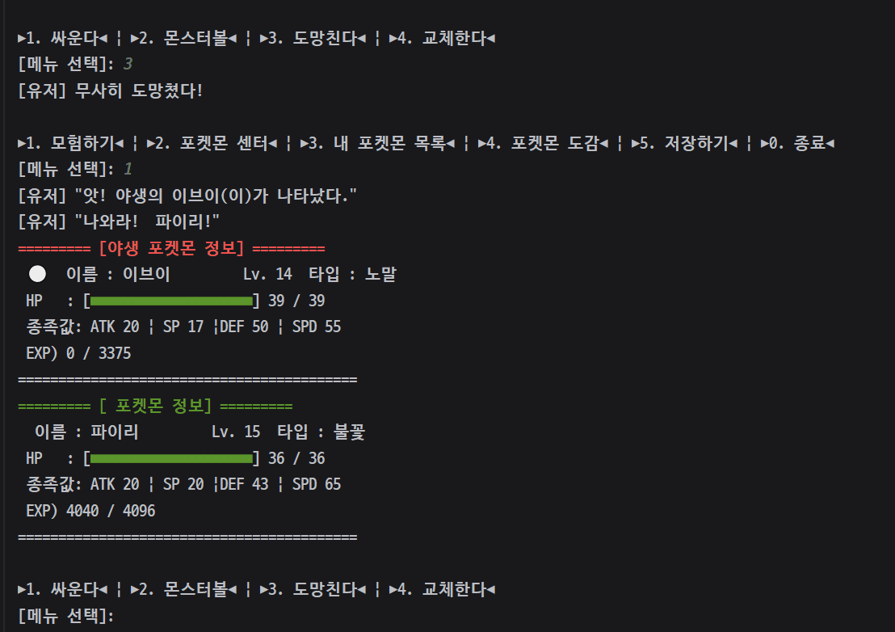

# Command Monster

<!-- 시연 영상(GIF) 이미지 태그 자리 -->

  

## 🎮 게임 소개

**Command Monster**는 자바(Java) 콘솔(CLI) 환경에서 작동하는 RPG 게임입니다. 플레이어는 초기 파트너 포켓몬을 선택하여 모험을 떠나고, 야생 포켓몬과 전투, 포획, 그리고 육성(레벨업 및 진화)을 경험하며 도감을 채워나가는 어드벤처 요소를 갖추고 있습니다.

## 🏗 아키텍처 (Layered Architecture)

유지보수성과 역할 분리를 위하여 관심사에 맞게 **레이어드 아키텍처(Layered Architecture)** 가 적용되어 있습니다.

- **App (애플리케이션 계층)**: 애플리케이션 진입점 및 초기 게임 진입 UI 구동 (`Main`, `App`)
- **Controller (컨트롤러 계층)**: 사용자 입력 흐름에 따라 뷰와 모델(서비스) 간의 이동을 제어 (`GameController`)
- **Service (비즈니스 계층)**: 배틀 진행, 포획 시스템, 데미지 및 경험치 계산 등 핵심 게임 로직 처리 (`GameService`)
- **Repository (퍼시스턴스 계층)**: 플레이어 모험 기록(Save/Load)과 몬스터 데이터 저장소 역할 (`PlayerRepository`, `GameRepository`)
- **Domain (도메인 계층)**: 몬스터, 인벤토리, 포켓몬 도감 등 데이터 상태와 내부 객체 행위를 관리 (`CommandMonster`, `PlayerInventory`, `Pokedex`)
- **View (프레젠테이션 계층)**: 콘솔 입출력 UI만을 전담하도록 분리 (`InputView`, `OutputView`)

## ✨ 구현된 핵심 기능

### 1. 파트너 선택 및 세이브/로드 도입

- 시작 시 **처음부터 하기**와 **이어서 하기(로드)** 기능 지원
- 첫 시작 시 매력적인 파트너 포켓몬(이상해씨, 파이리, 꼬부기) 중 선택하여 인벤토리로 등록

### 2. 배틀 시스템 (야생 몬스터 조우)

- **전투 선택지**: 공격(스킬), 포획 시도, 포켓몬 교체, 도망 기믹 구현
- **상태 처리**: 플레이어 포켓몬 기절 시 보유 중인 다른 포켓몬으로 즉시 교체 요구 로직
- **패배 조건**: 보유한 포켓몬이 모두 기절하면 눈앞이 깜깜해지며 포켓몬 센터로 자동 복귀

### 3. 포획 시스템

- 전투 중 야생 포켓몬에게 몬스터볼을 던져 확률에 기반한 포획 판정 시스템
- 성공 시 최대 6마리(인벤토리 제한) 덱에 아군으로 추가 및 도감 내 포획 상태(`Caught`)로 업데이트

### 4. 성장 및 진화 시스템

- 전투 승리 계산 방식 기반 경험치 획득, 기준치(Exp) 돌파 시 동적 레벨업 및 스탯 재연산(HP, Atk, Def 등)
- 특정 레벨에 도달하면 다음 단계로 변화하는 **진화 시스템** 자동 이벤트 활성화

  

### 5. 덱 편성과 몬스터 관리

- 메인 화면 메뉴를 통해서 언제든 보유한 파티 몬스터의 순서(`Swap`) 변경 가능 (전투 선봉 변경 용도)
- 인벤토리 여유 확보를 위한 포켓몬 방생(`Release`) 기능 지원

### 6. 도감(Pokedex) 생태계

- 게임 내 등장하는 모든 몬스터 데이터를 데이터베이스 객체와 비교 결합
- 전투에서 단순히 마주친 상태(`Seen`)와 볼로 직접 잡은 상태(`Caught`)를 인덱스별로 분류하여 도감 화면 제공

### 7. 포켓몬 센터 회복

- 센터 방문 메뉴를 통해 지치거나 빈사상태인 파티 내 모든 몬스터의 체력(HP) 일괄 풀회복 지원
